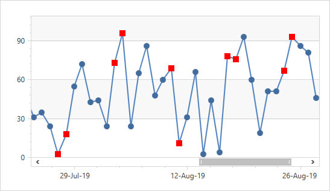

<!-- default badges list -->

[](https://supportcenter.devexpress.com/ticket/details/T828686)
[](https://docs.devexpress.com/GeneralInformation/403183)
[](#does-this-example-address-your-development-requirementsobjectives)
<!-- default badges end -->

# Chart for WPF - How to Select a Series Point Marker Based on a Point Argument

This example shows how to select a point marker type depending on a point argument.



* Create a subclass of [DataTemplateSelector](https://docs.microsoft.com/en-us/dotnet/api/system.windows.controls.datatemplateselector), override the [SelectTemplate](https://docs.microsoft.com/en-us/dotnet/api/system.windows.controls.datatemplateselector.selecttemplate) method to create a custom date template selector, and provide logic to select an appropriate marker type.

* Use [ContentControl](https://docs.microsoft.com/en-us/dotnet/api/system.windows.controls.contentcontrol) to specify the [CustomMarker2DModel.PointTemplate](https://docs.devexpress.com/WPF/DevExpress.Xpf.Charts.CustomMarker2DModel.PointTemplate) property.

* Assign the custom data template selector object to the [ContentControl.ContentTemplateSelector](https://docs.microsoft.com/en-us/dotnet/api/system.windows.controls.contentcontrol.contenttemplateselector) property.

```xaml
<dxc:ChartControl>
    <dxc:XYDiagram2D EnableAxisXNavigation="True">
        <dxc:LineSeries2D
            DataSource="{Binding DataItems, RelativeSource={RelativeSource AncestorType=Window, Mode=FindAncestor}}"
            MarkerVisible="True"
            ArgumentDataMember="DateTimeStamp"
            ValueDataMember="Value">
            <dxc:LineSeries2D.MarkerModel>
                <dxc:CustomMarker2DModel>
                    <dxc:CustomMarker2DModel.PointTemplate>
                        <ControlTemplate>
                            <ContentControl
                                Content="{Binding SeriesPoint}"
                                ContentTemplateSelector="{StaticResource myDataTemplateSelector}"/>
                        </ControlTemplate>
                    </dxc:CustomMarker2DModel.PointTemplate>
                </dxc:CustomMarker2DModel>
            </dxc:LineSeries2D.MarkerModel>
        </dxc:LineSeries2D>
    </dxc:XYDiagram2D>
</dxc:ChartControl>
```
## Files to Review

* [MainWindow.xaml](./CS/MainWindow.xaml) (VB: [MainWindow.xaml](./VB/MainWindow.xaml))
* [MainWindow.xaml.cs](./CS/MainWindow.xaml.cs) (VB: [MainWindow.xaml](./VB/MainWindow.xaml))

## More Examples 

* [Chart for WPF - How to Create Custom Series Point Markers](https://github.com/DevExpress-Examples/wpf-chart-create-custom-series-point-markers)
  
## Documentation

* [Series Points](https://docs.devexpress.com/WPF/6340/controls-and-libraries/charts-suite/chart-control/series/series-points)
* [Series and Marker Models](https://docs.devexpress.com/WPF/4285/controls-and-libraries/charts-suite/chart-control/series/series-and-marker-models)
<!-- feedback -->
## Does this example address your development requirements/objectives?

[](https://www.devexpress.com/support/examples/survey.xml?utm_source=github&utm_campaign=select-a-series-point-marker-based-on-a-point-argument&~~~was_helpful=yes) [](https://www.devexpress.com/support/examples/survey.xml?utm_source=github&utm_campaign=select-a-series-point-marker-based-on-a-point-argument&~~~was_helpful=no)

(you will be redirected to DevExpress.com to submit your response)
<!-- feedback end -->
